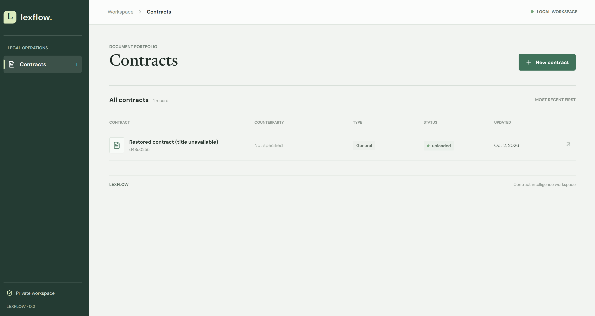
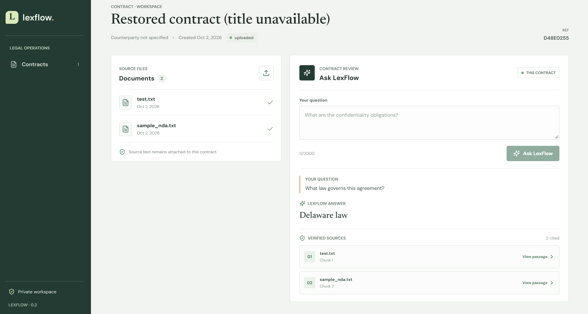
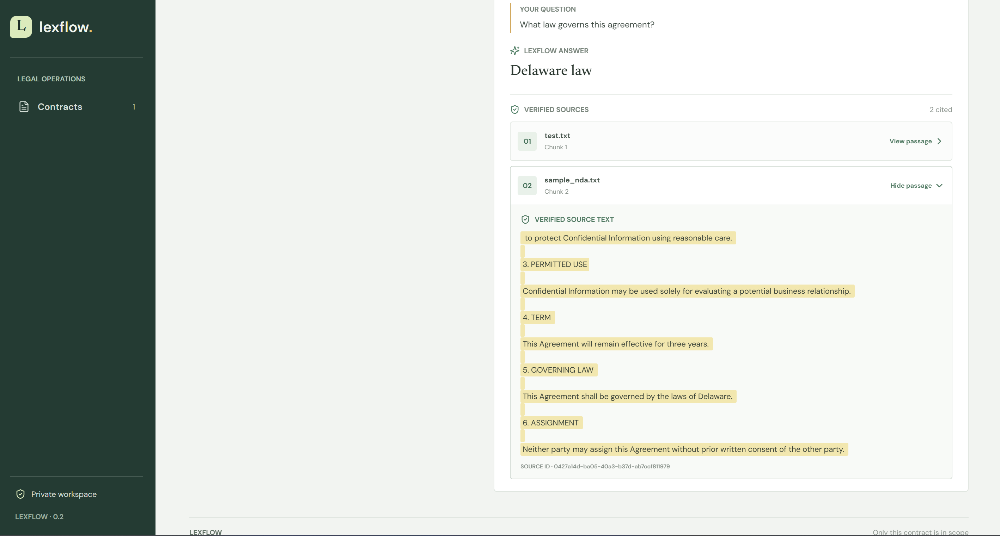
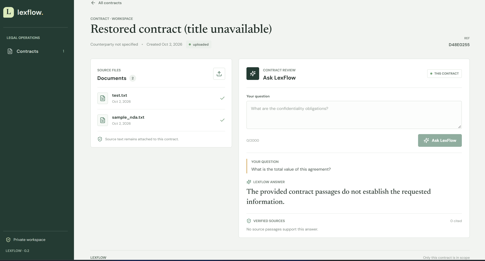
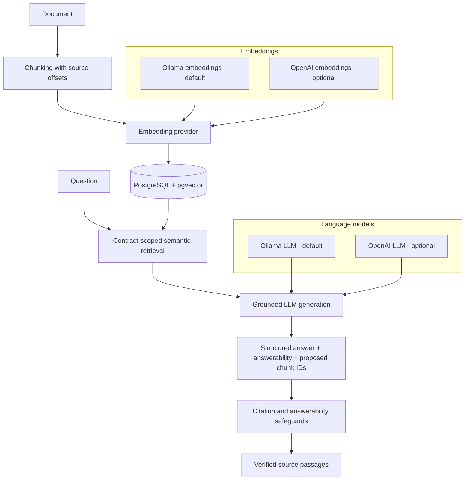

# LexFlow

**LexFlow turns contract documents into source-grounded answers with citations that are checked against the stored document passages.**

LexFlow is a full-stack legal AI and contract-intelligence portfolio project. It
combines semantic retrieval with a pluggable LLM layer so users can ask questions
about a contract, inspect the passages behind an answer, and see an explicit
abstention when retrieved evidence does not support an answer.

The default local AI stack uses Ollama; OpenAI is an optional hosted alternative.

## Demo: https://youtu.be/Fz_ERbbU5KE

### Contract workspace

Landing Page. Access: Contract details, uploaded source files, and the question panel.



### Grounded answer

An answer generated from retrieved contract passages.



### Verified citation and source passage

The cited chunk displayed as supporting source text.



### Unsupported-question abstention

An example of the API declining to provide a substantive answer when safeguards
do not find sufficient cited support.



## Why LexFlow

Language models can produce plausible-sounding legal answers even when a contract
does not support them. A citation that points to a real passage is not, by itself,
proof that the passage supports the answer.

LexFlow addresses this engineering problem with a traceable Q&A pipeline:

1. Preserve uploaded text and split it into chunks with source offsets.
2. Embed the chunks and retrieve relevant passages within the selected contract.
3. Ask a configured LLM to answer from those passages and return structured
   answerability and citation data.
4. Validate the structured response and resolve proposed citation IDs against the
   retrieved chunks.
5. Return the matching source passages, or abstain when safeguards reject the answer.

This is a defense-in-depth design, not a guarantee of legal correctness.

## Architecture



The backend is built with FastAPI. PostgreSQL stores contracts, original document
text, chunks, source offsets, and pgvector embeddings. The React/TypeScript
frontend calls the API and displays returned citations; retrieval and citation
validation remain backend responsibilities.

Provider choice is environment-configured. LLM and embedding providers can be
selected independently. Embedding profiles record provider, model, and vector
dimension; changing embedding models requires reindexing documents before
retrieval.

## Features

### Implemented

- Contract creation, listing, and detail API.
- UTF-8 text document upload and listing.
- Paragraph-aware chunking with source offsets.
- Configurable embedding and LLM provider interfaces.
- Ollama as the default local inference option; OpenAI as an optional hosted provider.
- Independent provider selection, including mixed local/hosted configurations.
- PostgreSQL and pgvector storage with contract-scoped semantic search.
- Grounded Q&A using structured model output and an explicit `answerable` result.
- Citation IDs checked against retrieved chunks, with source passages returned to
  the frontend.
- Conservative abstention safeguards, including a guard against treating contract
  duration as a termination right.
- AI provider health diagnostics at `GET /health/ai`.
- A small fixture-based evaluation harness and automated backend tests.
- Docker Compose development stack.

### Not implemented yet

Structured clause extraction, normalized contract terms, playbooks, deviation
analysis, and a human review/audit workflow are roadmap items, not current
capabilities.

## Trust and Grounding

- **Answerability:** the model response includes an answerability flag. The API
  downgrades answers that fail its conservative safeguards, including answers
  without an acceptable citation.
- **Verified chunk IDs:** citation IDs must resolve to chunks retrieved for the
  current contract question. Unknown IDs are rejected; they are not treated as
  source evidence.
- **Source provenance:** returned citations contain persisted chunk text. Chunks
  retain document-relative start and end offsets so their text can be checked
  against the original stored document.
- **Abstention:** unsupported or insufficiently cited answers are replaced with
  an explicit statement that the supplied passages do not establish the requested
  information.
- **Provider independence:** grounding instructions, answerability checks, and
  citation resolution are LexFlow responsibilities shared across configured LLM
  providers.

The current relevance and termination safeguards are conservative heuristics, not
a semantic entailment engine. Valid citations and abstention behavior reduce
specific failure modes but do not guarantee that all answers are correct or
constitute legal advice.

## Evaluation

The evaluation fixture is
[`tests/fixtures/grounded_qa_cases.json`](tests/fixtures/grounded_qa_cases.json).
It contains ten concept-based cases against `sample_nda.txt`: six supported
questions and four unsupported questions. The live harness isolates retrieval to
that named document, even if other documents are attached to the contract.
Production retrieval remains contract-scoped.

Run the harness against an uploaded sample NDA using Ollama:

```powershell
python -m scripts.evaluate_grounded_qa --contract-id <contract-uuid> --models llama3.2:3b
```

It reports retrieval evidence coverage, concept coverage, answerability and
abstention, citation relevance and ID validity, source-offset checks, structured
output success, and generation latency. The benchmark is small and useful for
regression/evaluation work; it is **not** evidence of production legal accuracy.

## Technology

- Python, FastAPI, Pydantic
- PostgreSQL, pgvector
- React, TypeScript, Vite
- Ollama local inference
- Optional OpenAI LLM and embedding providers
- Docker Compose
- Pytest

## Running Locally

Prerequisites: Docker Desktop with Compose, Ollama, Node.js 20.19+ and npm.

1. Install/start Ollama, then download the default local models:

   ```powershell
   ollama pull llama3.2:3b
   ollama pull nomic-embed-text
   ollama list
   ```

2. From the repository root, start PostgreSQL and the API:

   ```powershell
   docker compose up -d --build
   ```

   Compose configures the backend to reach host-running Ollama at
   `http://host.docker.internal:11434` by default. If needed, set
   `OLLAMA_DOCKER_BASE_URL` in `.env` to the Ollama address reachable from Docker.

3. Confirm API and provider status:

   ```powershell
   Invoke-RestMethod http://127.0.0.1:8000/health
   Invoke-RestMethod http://127.0.0.1:8000/health/ai
   ```

4. In a second terminal, start the frontend:

   ```powershell
   Set-Location frontend
   npm install
   npm run dev
   ```

   Open <http://127.0.0.1:5173>. Create a contract, upload a `.txt` agreement,
   ask a question, and expand a returned citation to inspect its source passage.
   API documentation is available at <http://127.0.0.1:8000/docs>.

### Optional OpenAI provider

Create a local `.env` from `.env.example`, set `OPENAI_API_KEY` locally, and
select OpenAI for one or both provider types. Do not commit `.env` or API keys.

```dotenv
# Default local configuration
LLM_PROVIDER=ollama
EMBEDDING_PROVIDER=ollama

# Hosted providers
LLM_PROVIDER=openai
EMBEDDING_PROVIDER=openai
OPENAI_API_KEY=your-key

# Mixed configurations are also supported
LLM_PROVIDER=openai
EMBEDDING_PROVIDER=ollama
```

The reverse mixed configuration (`LLM_PROVIDER=ollama` with
`EMBEDDING_PROVIDER=openai`) is supported too. If the embedding provider or model
changes, reindex existing documents before searching:

```powershell
docker compose exec backend python -m app.reindex_embeddings
```

The reindex operation rebuilds derived chunks and vectors from stored source text.

## Tests

Run the suite against a dedicated PostgreSQL database whose name ends in `_test`;
the API test fixture refuses to truncate other databases. With the Compose
PostgreSQL service running, create the test database once:

```powershell
docker compose exec postgres psql -U lexflow -d postgres -c "CREATE DATABASE lexflow_test"
```

For the local Compose development database, run:

```powershell
# Replace these placeholders with your local PostgreSQL credentials.
$env:DATABASE_URL = "postgresql://<user>:<password>@localhost:5432/lexflow_test"
python -m pytest -q
```

Do not commit real credentials. Update the connection string if you customize
the Compose database configuration.
The automated tests use fake providers and mocked provider HTTP responses; they
do not require Ollama inference or paid OpenAI API access. To verify the frontend:

```powershell
Set-Location frontend
npm run typecheck
```

## Roadmap

- Structured clause extraction with document/chunk provenance.
- Normalized contract terms.
- Company playbooks and configurable positions.
- Deviation analysis and risk/issue flags.
- Human review, correction, and acceptance workflow.
- Audit trail for review decisions.

These items are planned work and are not represented as implemented features.

## Disclaimer

LexFlow is an engineering and portfolio project for demonstrating full-stack
software and grounded-AI design. It is not legal advice, does not replace a
qualified lawyer, and should not be used as the sole basis for legal decisions.
